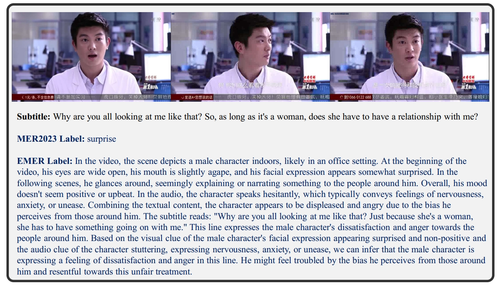

# AffectGPT: Audio-Video-Text Aligned Model for Explainable Multimodal Emotion Reasoning


## Task

Explainable multimodal emotion reasoning aims to predict emotion labels and reasoning process for these predictions using multimodal clues.




Details can be found in our paper: [**Explainable Multimodal Emotion Reasoning**](https://arxiv.org/pdf/2306.15401.pdf)

```tex
@article{lian2023explainable,
  title={Explainable Multimodal Emotion Reasoning},
  author={Lian, Zheng and Sun, Licai and Xu, Mingyu and Sun, Haiyang and Xu, Ke and Wen, Zhuofan and Chen, Shun and Liu, Bin and Tao, Jianhua},
  journal={arXiv preprint arXiv:2306.15401},
  year={2023}
}
```


## Dataset

To construct the initial dataset, we select samples from the large-scale video emotion dataset, MER 2023. Due to the high annotation cost, we randomly annotate 100 non-neutral samples to form the initial dataset.

1. Download [**MER 2023 Dataset**](https://arxiv.org/pdf/2304.08981.pdf)

To download the dataset, please fill out an [**EULA**](https://drive.google.com/file/d/1LOW2e6ZuyUjurVF0SNPisqSh4VzEl5lN) and send it to **merchallenge.contact@gmail.com**. It requires participants to use this dataset only for academic research and not to edit or upload samples to the Internet.

```tex
@article{lian2023mer,
  title={MER 2023: Multi-label Learning, Modality Robustness, and Semi-Supervised Learning},
  author={Lian, Zheng and Sun, Haiyang and Sun, Licai and Zhao, Jinming and Liu, Ye and Liu, Bin and Yi, Jiangyan and Wang, Meng and Cambria, Erik and Zhao, Guoying and others},
  journal={arXiv preprint arXiv:2304.08981},
  year={2023}
}
```


2. Annotations

We provide emotion and reason in **./instruction-dataset/EmoReason**.

**gt-chi.csv** and **gt-eng.csv** represent Chinese and English version annotations, respectively.


## Baselines

We exam [PandaGPT](https://github.com/yxuansu/PandaGPT), [Valley](https://github.com/RupertLuo/Valley), [VideoChat](https://github.com/OpenGVLab/Ask-Anything),[Video-ChatGPT](https://github.com/mbzuai-oryx/Video-ChatGPT), [Video-LLaMA](https://github.com/DAMO-NLP-SG/Video-LLaMA). Prediction results can be found in **./baseline_results**.

```
# files
gt.csv: ground truth annotations
pandagpt.csv: prediction results of PandaGPT
valley.csv: prediction results of Valley
videochat(emb).csv: prediction results of VideoChat-Embed
videochat(text).csv: prediction results of VideoChat-Text
videochatgpt.csv: prediction results of Video-ChatGPT
videollama.csv: prediction results of Video-LLaMA

# columns:
names: video name
chi_reasons: reasoning process (in Chinese). We do not provide English version. You can generate such info via translation function in ChatGPT or other toolkits.
```


## Evaluation

We provide ChatGPT-based evaluation approaches. See evaluation.py for more details.

Please ensure you have an OpenAI key and can access to ChatGPT.

```
# evaluate for full datasets
python eval_release.py --data_root=[your data root] --openai_key=[your openai key]

# only run the code for debug
python eval_release.py --data_root=[your data root] --openai_key=[your openai key] --debug
```


## AffectGPT

We aim to train an audio-video-text aligned model  to deal with explainable multimodal emotion reasoning. Specifically, we modify the code in [Video-LLaMA](https://github.com/DAMO-NLP-SG/Video-LLaMA) and make it support for audio-video-text aligned training. Meanwhile, we unify the input for different datasets, remove some unnecessary modules, add model.eval() during inference, etc. More details can be found in our implementation.

1. Environment Preparation

Different CUDA versions may need different install approach:

```none
## machine1: 
# conda env create -f environment.yml

## machine2: cuda=11.7
# conda create --name=videollama python=3.9
# conda install pytorch==1.13.0 torchvision==0.14.0 torchaudio==0.13.0 pytorch-cuda=11.7 -c pytorch -c nvidia
# pip install -r requirement.txt # Note: remove already installed packages in requirement.txt

## machine3：cuda=10.2
# conda create --name=videollama python=3.9
# conda install pytorch==1.12.1 torchvision==0.13.1 torchaudio==0.12.1 cudatoolkit=10.2 -c pytorch
# conda install transformers
# pip install -r requirement.txt # Note: remove already installed packages in requirement.txt

## other errors：libGL.so.1 errors in opencv, then yum install mesa-libGL
```


2. Dataset Preparation

```
# instruction-dataset/LLaVA
1. llava_instruct_150k.json: https://huggingface.co/datasets/liuhaotian/LLaVA-Instruct-150K/blob/main/llava_instruct_150k.json
2. COCO train2017: https://cocodataset.org/#download

# instruction-dataset/EmoReason
1. To download the dataset, please fill out an [EULA](https://drive.google.com/file/d/1LOW2e6ZuyUjurVF0SNPisqSh4VzEl5lN) and send it to merchallenge.contact@gmail.com. It requires participants to use this dataset only for academic research and not to edit or upload samples to the Internet.
2. gt-eng.csv and gt-chi.csv

# instruction-dataset/MiniGPT-4
https://drive.google.com/file/d/1nJXhoEcy3KTExr17I7BXqY5Y9Lx_-n-9/view

# instruction-dataset/VideoChat
videochat_instruct_11k.json: https://drive.google.com/file/d/1C-7xmf42QUEi4ApXTcxBHr5nLvTWXyUi
webvid: https://github.com/m-bain/webvid. We also modify download.py for acceleration
```


3. Pre-trained Model Preparation

```
# models/finetune_vicuna7b_audiobranch.pth
https://huggingface.co/DAMO-NLP-SG/Video-LLaMA-Series/resolve/main/finetune-vicuna7b-v2.pth

# models/finetune_vicuna7b_videobranch.pth
https://huggingface.co/DAMO-NLP-SG/Video-LLaMA-Series/resolve/main/finetune_vicuna7b_audiobranch.pth

# models/blip2_pretrained_flant5xxl.pth
https://storage.googleapis.com/sfr-vision-language-research/LAVIS/models/BLIP2/blip2_pretrained_flant5xxl.pth

# models/eva_vit_g.pth
https://storage.googleapis.com/sfr-vision-language-research/LAVIS/models/BLIP2/eva_vit_g.pth

# models/imagebind_huge.pth
https://dl.fbaipublicfiles.com/imagebind/imagebind_huge.pth

# models/pretrained_minigpt4.pth
https://drive.google.com/file/d/1a4zLvaiDBr-36pasffmgpvH5P7CKmpze

# models/vicuna-7b-v0
llama-7b-hf: https://huggingface.co/decapoda-research/llama-7b-hf/tree/main
vicuna-7b-delta-v0: https://huggingface.co/lmsys/vicuna-7b-delta-v0/tree/main
python3 apply_delta.py --base {path for llama-7b-hf} --delta {path for vicuna-7b-delta-v0} --target vicuna-7b-v0

# ./bert-base-uncased
https://huggingface.co/bert-base-uncased
```


4. Training and Inference

```
conda activate videollama

# training with one gpu
python train.py --cfg-path=./train_configs/multimodal_llama_stage3_finetune.yaml

# training with 8 gpu
torchrun --nproc_per_node=8 train.py --cfg-path=./train_configs/multimodal_llama_stage3_finetune.yaml

# inference for one epoch (one emotion reasoning performance)
python inference.py --gpu-id=0 --cfg-path="eval_configs/video_llama_eval_withaudio_stage3.yaml" \
					--ckpt_root="video_llama/output/multimodal_llama_stage3_finetune/20230722155059_100_1000_1000" \
					--test_epochs="0-0"

# inference for multiple epochs (one emotion reasoning performance)
python inference.py --gpu-id=0 --cfg-path="eval_configs/video_llama_eval_withaudio_stage3.yaml" \
					--ckpt_root="video_llama/output/multimodal_llama_stage3_finetune/20230722155059_100_1000_1000" \
					--test_epochs="0-9"
```

